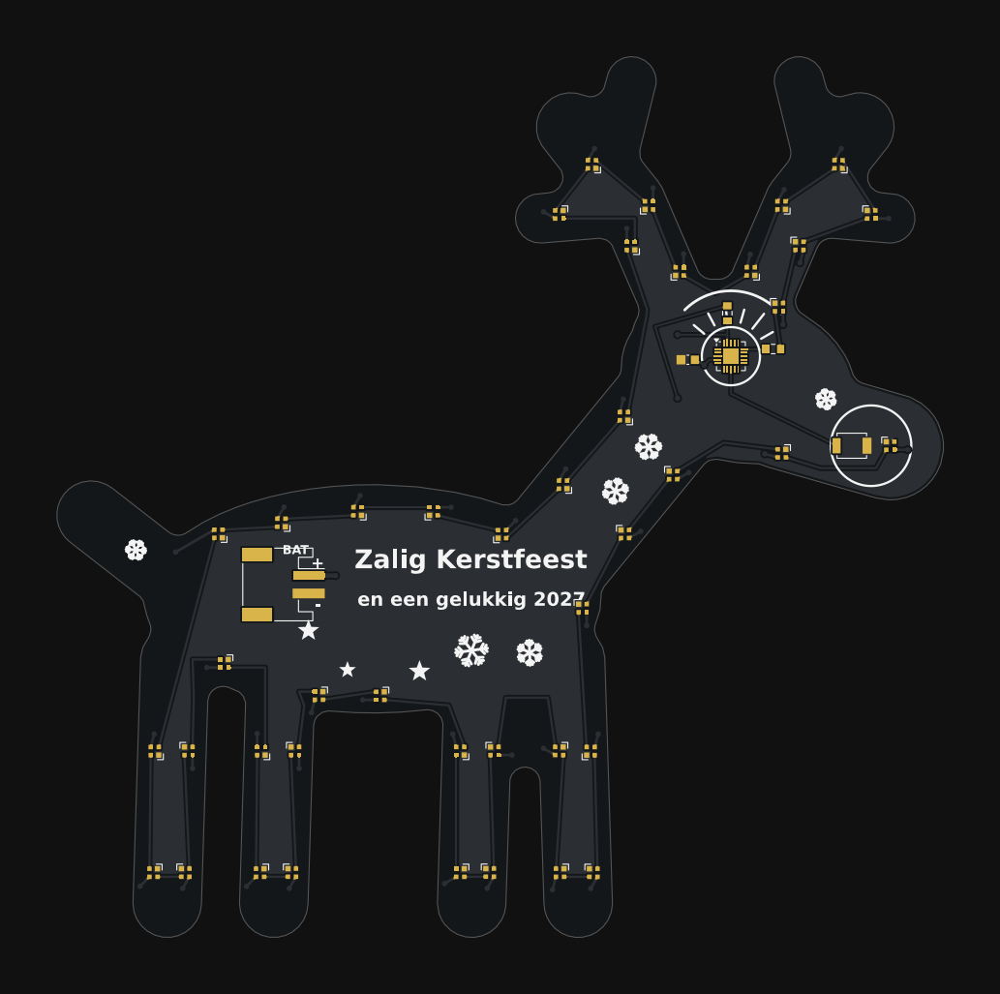
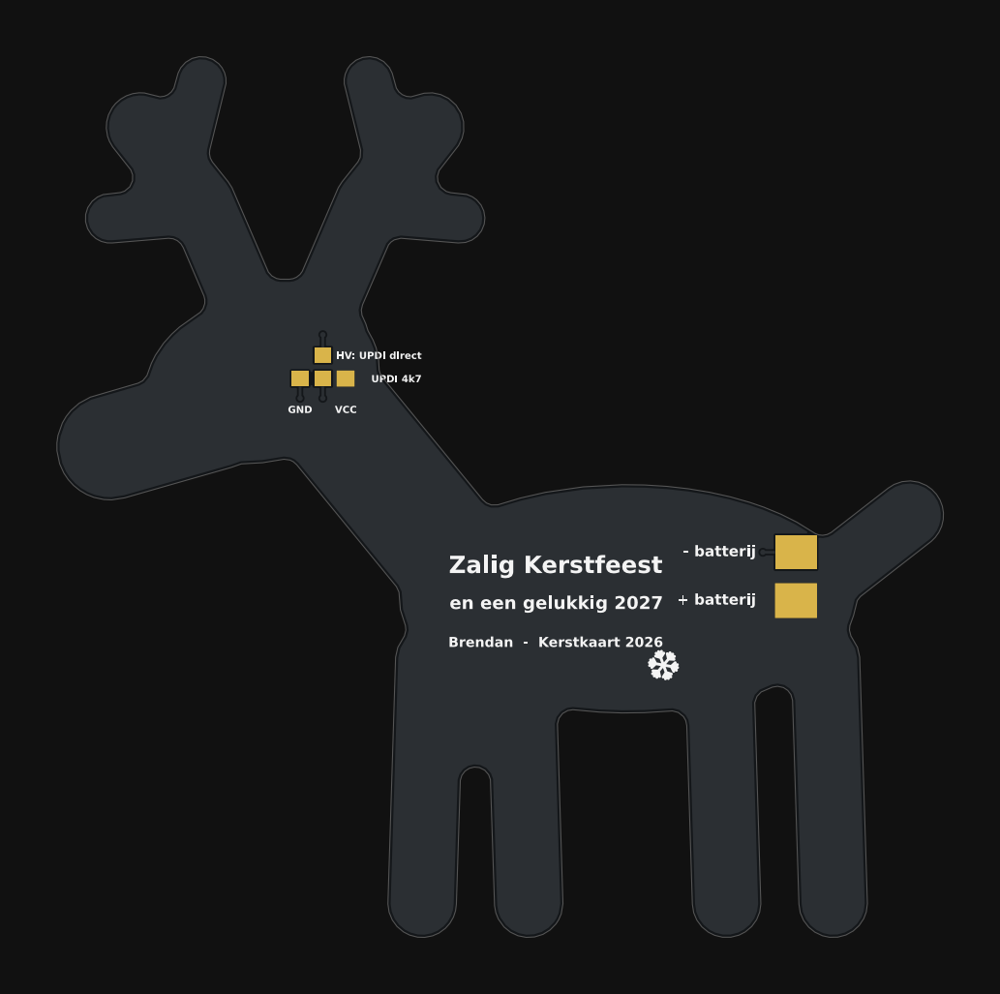

# Kerstkaart 2026 – Rudolf het rendier

Een printplaat in de vorm van een rendier (96 × 98 mm) met 42 piepkleine NeoPixels. De ATtiny is het **oog**, het knopje is de **neus**,
de overige onderdelen zijn wimpers en wenkbrauw. Op de voorkant staat de kerstboodschap *Zalig Kerstfeest en een gelukkig 2027*.

| Voorkant | Achterkant |
|---|---|
|  |  |

## Ontwerp

| Onderdeel | Type | LCSC |
|---|---|---|
| 42 × LED | SK6805-EC15, 1,5 × 1,5 mm NeoPixel (5 mA, 3,7–5,5 V) | C2890035 |
| Oog | ATtiny1616-MNR, VQFN-20 3×3 mm | C507118 |
| Neus | Omron B3U-1000P, 3 × 2,5 mm tactknopje | C231329 |
| 2e batterij-aansluiting | JST PH S2B-PH-SM4-TB (2 pens, in de heup) | C295747 |
| C1 / R1 / R2 | 100 nF / 330 Ω (data) / 4,7 kΩ (UPDI), alle 0603 | C14663 / C23138 / C23162 |

* **Chip als oog:** een witte silkring maakt van de QFN de pupil; C1, R1 en R2 staan rond de ring als wimpers, met een wenkbrauw erboven.
* **Knop als neus:** de B3U zit in de snuit, met de rode neus-LED ernaast; een silkring om beide. Indrukken = volgend lichtprogramma, lang indrukken = helderheid.
* **Geweien identiek:** gewei A is een exacte spiegel van gewei B (elk 5 LED's); de firmware gebruikt `gewei_rang()` zodat alle effecten links en rechts gelijk lopen.
* **LED's recht:** alle LED's staan in 0°/90°/180°/270° t.o.v. de footprint.
* **Batterij (3 × AAA, ≥ 4,5 V):** grote koperpads `+` / `-` op de achterkant (4,6 × 3,8 mm) om draden op te solderen, **of** de JST-PH-connector in de heup.
* **Programmeren, op de achterkant:** rij `GND – UPDI 4k7 – VCC` met UPDI in het midden (via R2), en een aparte pad **`HV: UPDI direct`** die rechtstreeks aan de UPDI-pen hangt voor hoogspanningsprogrammering.
* **Pinnen** (uit het KiCad-symbool): pen 3 GND, 4 VCC, 8 PA7 = knop, 15 PC0 = data, 19 UPDI, 21 = EP (GND).

## Kleurkeuze (1 kleur silk)
Zwart soldeermasker, witte silk, ENIG-goud: de LED's lichten het mooist op, de boodschap is goed leesbaar en het goud accentueert de blanke pads (`HV`, `UPDI`, batterijpads, oog en neus).
Alternatief: rood masker + witte silk. Een volledig kleuren-silkscreen is een EasyEDA Pro-functie die ik hier niet kan genereren.

## Bestanden

| Pad | Inhoud |
|---|---|
| `kerstkaart_2026_gerber.zip` | Gerbers + boorbestand (JLCPCB) |
| `productie/BOM_kerstkaart_2026.csv`, `productie/CPL_kerstkaart_2026.csv` | Stuklijst en plaatsingsbestand |
| `kerstkaart2026.kicad_pcb` | KiCad-bord (KiCad 10-formaat, **ongetest**, de Gerbers zijn leidend) |
| `footprints/` | De KiCad-bibliotheekfootprints van alle onderdelen |
| `firmware/kerstkaart2026/` | Arduino-sketch (megaTinyCore + tinyNeoPixel) + `leds.h` |
| `gen.py`, `shape.py`, `ketting.py`, `kunst.py`, `sexp.py` | Generator: silhouet, LED-volgorde, silk-kunst → Gerbers, BOM, CPL, renders, `leds.h` |

## Nog controleren
* **Gerbers/CPL:** ingelezen met `gerbonara` (8 lagen + boorbestand herkend), maar niet in KiCad of in JLC's viewer bekeken. Controleer daar de **rotatie** van LED's, U1, knop en connector (JLC wijkt soms 90°/180° af), en of JLC de SK6805-EC15 en B3U-1000P op voorraad heeft.
* **Mijn eigen controle** (spoor/pad-afstand 0,2 mm, randafstand 0,4 mm, GND en VCC elk één samenhangend vlak) is geen volledige DRC.
* **SK6805-EC15:** pinout uit de datasheet (1 DIN, 2 VDD, 3 DOUT, 4 GND, GND linksboven gezien van boven); de padmaten (0,5 × 0,5 mm op 0,9 mm) komen uit de KiCad EC15-footprint, niet uit de datasheet-afbeelding. Het type is dimmer (5 mA) en heeft minstens 3,7 V nodig: een bijna lege batterij laat de LED's eerder uitvallen dan de chip.
* **JST-polariteit:** pen 1 = `+`, pen 2 = `-` (aangegeven in silk); kies je batterijkabel hierop.
* De 0603-LCSC-nummers zijn niet apart geverifieerd. De 5-LED-geweien laten de binnenste zijtak onverlicht.
* Firmware alleen op syntax gecontroleerd, niet op een echte ATtiny.

## Licentie en bronnen
De footprints in `footprints/` komen uit de KiCad-bibliotheken (CC-BY-SA 4.0 met uitzondering voor het gebruik in ontwerpen). De overige bestanden zijn van Brendan.
